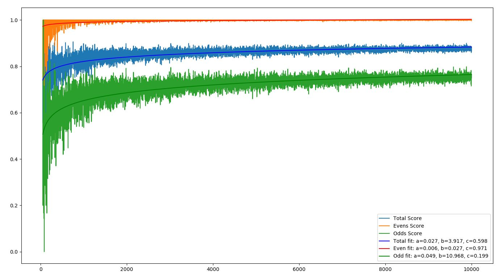

# Using Machine Learning to Predict Prime Numbers

## Breakdown of Process
1. Creates the DataFrame of the number, it's digits (-1's indicate no digit), and whether it is a prime number or not. (Python, NumPy, Pandas). A few example rows are shown below.

id | Number | "1000" | "100" | "10" | "1" | Prime 
--- | --- | --- | --- | --- | --- | ---
0 | 2 | -1 | -1 | -1 | 2 | 1
32 | 34 | -1 | -1 | 3 | 4 | 0
935 | 937 | -1 | 9 | 3 | 7 | 1

2. Shuffles the DataFrame then splits it up into 80% going into a training set and the other 20% going into a testing set.
3. Uses the training set to create a Random Forest Classifer to create a model of Prime Numbers given their digits. (Scikit-learn).
4. Tests the models on the training set in three ways.  It first tests its score on the total set of testing data, then on the even numbers in the testing set, then on the odd numbers.  
5. Plots the accuracy of the model given a certain amount of numbers you use to train the model.  (Matplotlib).
6. Fits each model to y = alog(bx)+c (SciPy) 

## Example Output

